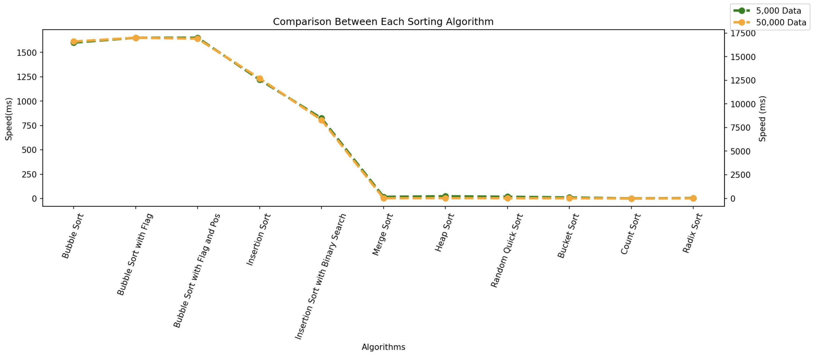

# Implement_Sort_Algorithm

This project contains 11 different sorting algorithms implemented by Python 

### 1. Bubble Sort (Common Version)
  
  Time Complexity: O(N^2)

  Space Complexity: O(1)
  
### 2. Bubble Sort (With Flag)

  Time Complexity: O(N^2)
  
  Best Case: O(N), When the sequence is almost sorted
  
  Space Complexity: O(1)
  
### 3.Bubble Sort (With Flag and Pos)

  Time Complexity: O(N^2)
  
  Best Case: O(N), When the sequence is almost sorted
  
  Space Complexity: O(1)
  
### 4.Insertion Sort (Common Version)

  Time Complexity: O(N^2)
  
  Best Case: O(N)。

  Space Complexity: O(1)
  
### 5.Insertion Sort (With Binary Search Index)
   
  Time Complexity: O(N^2),slightly better than common version since the search of index is O(logN)
  
  Best Case: O(N)。

  Space Complexity: O(1)
  
### 6.Merge Sort
  
  Time Complexity: O(N*LogN)

  Space Complexity: O(N)
  
### 7.Heap Sort
  
  Time Complexity: O(N*LogN). Building Heap: N*O(logN);Delete Max:O(1);Maintaining Heap Structure: N*O(logN)

  Space Complexity: O(N)
  
### 8.Randomized Quick Sort
  
  Time Complexity: O(N*LogN), With extremely low probabity O(N^2)

  Space Complexity: O(N)

## Special Sorting Algorithms with conditions

### 9. Bucket Sort
  
  The Range of the Sequence can not be too large or the space for the bucket is not enough in the memory.
  
  Time Complexity: O(N * Log (N/M)) Or O(N) when M >> N, Where M is the number of buckets used
  
  Space Complexity: O(M)
  
### 10.Count_Sort
  
  The Range of the Sequence can not be too large and all the elements in the sequence must be integers.

  Time Complexity: O(N)

  Space Complexity: O(M),where M is the range of the sequence
  
### 11.Radix_Sort

  All the elements in the sequence must be Integers.
  
  Time Complexity：O(k*N) Or O(N), when k is the maximum length of element in the sequence. However, normally k < 30.

  Space Complexity：O(N)

